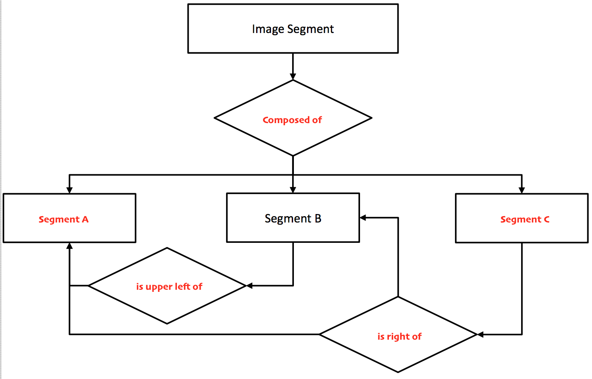

> 
> Sample solution provided by **Changkun Ou**
> 
> Note that it may incorrect.
> 

## Task 1

### a)

High-Level Structured Metadata.

Keywords is humanreadable for the actual content of the video.

### b)

1. Retrieval from external databases;
2. Manual addition

### c)

#### i.

MPEG-7 is a stadard for describing multimedia content data (including video).

#### ii.

No. MPEG-7 is not aimed at any one application inparticular; rather the elements that MPEG-7 support as broad a range of applications as possible.

#### iii.

Simple Metadata Profile.

SMP is used for single document or simple collection, which is suitable for this case (independent video clips).

### d)

||description scheme|example|
|:--:|:--:|:--:|
|temporal|Video Segment DS|a clip describe how much of a normal manager salaries|
|spatial|Still Region DS|a frame contains how many different manager|
|spatiotemporal|Moving Region DS|A time range describe a manger show up from which time stamp to another stamp|

### e)



## Task 2

### a)

*Dynamic Animations in the browser*

- [x] client side
- [ ] server side

**Explanation**: Animation is powered by CSS and client JavaScript.

*Password-strength feedback*

- [x] client side
- [ ] server side

**Explanation**: client side is good enough to implement this feature, considering Dropbox `zxcvbn`. Another reason for this is to relieve queries of server.

*Flight booking*

- [ ] client side
- [x] server side

**Explanation**: booking is related to the remain ticket repository, server side should make the final dicition of how tickets assign to someone.

### b)

```php
// index-based array
array_push($array, "mmn");
// associative array
$array[$newKey] = "mmn";
```

### c)

```php
<?php
// a. session initialize
session_start();
?>
<!DOCTYPE html>
<html lang="en">
<head>
  <meta charset="UTF-8">
  <title>Login</title>
</head>
<body>
<?php
$pw = password_hash('swordfish', PASSWORD_DEFAULT);

// b. verification only if 
if (isset($_POST['alias']) && isset($_POST['pass']) && isset($_POST['sub'])) {
  // c. use password_verify
  if (password_verify($_POST['pass'], $pw)) {
    // d. update session
    $_SESSION['alias'] = $_POST['alias'];
  } else {
    // e. red message
    echo '<p style="color: red;">Wrong Password!</p>';
  }
}

// f. session destroy
if (isset($_POST['out'])) {
  session_destroy();
  $_SESSION = array(); // or session_unset();
}


if (!isset($_SESSION['alias'])) {
  ?>
  <form method="post">
    <input type="text" name="alias" placeholder="alias">
    <input type="password" name="pass" placeholder="password">
    <input type="submit" name="sub">
  </form>
  <?php
} else {
  
  // g. greet info
  echo '<p>Hello '.$_SESSION['alias'].'</p>';

  echo '<p>The answer is 42!</p>';
  echo '<form method="post">';
  echo '  <input type="submit" name="out" value="Logout">';
  echo '</form>';
}
?>
</body>
</html>
```

## Task 3

### a)

1. XML is only for data exchange;
2. JSON is more smaller, simple and efficient than XML;
3. JSON gains its popularity.

### b)

```jsx
<!DOCTYPE html>
<html lang="en">
<head>
	<meta charset="UTF-8">
	<title>Phone Info</title>
	<script src="https://code.jquery.com/jquery-2.1.3.min.js"></script>
	<script>
	// a. ensure DOM is ready
	$(document).ready(function() {
		var searchURL = 'http://phoneinfo.com/';
		
		// b. create GET request
		$.get(searchURL).done(function(data) {
			var ul = $('<ul>');
			var container = $('#container');
			var infobox   = $('#infobox');
			
			// c.i. create <ul> element to container div.
			container.append(ul);
			
			// c.ii. create <li> element to ul.
			data.forEach(function(item) {
				var li = $('<li>');
				ul.append(li.html(item.model));
				
				// c.iii. add click listener to each li.
				li.on('click', function() {
					infobox.html(item.model + ' costs ' + item.price + ' EUR.');
				});
			})
		});
	});
	</script>
</head>
<body>
<div id="container"></div>
<div id="infobox"></div>
</body>
</html>
```

### c)

```html
<template is="dom-bind">
	<iron-ajax auto url="http://phoneinfo.com/" last-response="{{phones}}"><iron-ajax>
	<ul>
		<template is="dom-repeat" items="[[phones]]">
			<li>[[item.model]]</li>
		</template>
	</ul>
</template>
```

## Task 4

### a)

#### i.

LAMP: Linux + Apache + MySQL + PHP
MEAN: MongoDB + Express + Angular + NodeJS

#### ii.

1. MEAN use document database, but LAMP use relational database.
2. MEAN has no Operating System restriction, all OS that can driven NodeJS can depoly MEAN, but LAMP only on Linux.

### b)

```bash
npm install --save body-parser
```

### c)

```js
var express = require('express');
var bodyParser = require('body-parser');
var prices = {
	p8lite : 172,
	iphone6s : 745,
	galaxyS7 : 647,
	lumia640 : 112
};
var app = express();

app.use(bodyParser.json());
app.use(bodyParser.urlencoded({extended:false}));

app.post('/updateprice', (req, res) => {
  if (req.body.model && req.body.price === undefined) {
    prices[req.body.model] = req.body.price;
  }
  res.send(prices);
});

app.get('/price', (req, res) => {
  res.json(prices);
});

app.listen(1612);
```

### d)

```bash
http://localhost:1612/prices
```

## Task 5

### a)

#### i.

HTML video players is unified plug-in free, safe, and built based on HTML 5 specification and commercial media encoding capabilities.

#### ii.

Because their primary purpose is to allow web browsers to play DRM-encurmbered streaming content, but most content provider would like to deliver their content via some other means unless browsers fully support.

#### iii.

1. Netflix need a stack of technologies to protect thier content for quick and safe delivery. 
2. DASH is used for dynamic adaption which makes content can be diliver fast. 
3. EME/CENC can be used for conetent encryption.
4. Additional resources such as subtitles can be provided based on MSE.

#### iv.

HTML5 is the-state-of-the-art industry solution that cross all browser, platform, conent and devices going forward. But Silverlight is only supported on IE and it is based on proprietary web plug-gin based delivery mechanisms.

### b)

1. The media Presentation Description must contains the audio description and special adaption strategy instead of video;
2. When the provider decided to provide a audio stream service, considering Spotify Music stream service.

### c)

MPEG-DASH Standard defined streaming is end-to-end controled by HTTP server and DASH client.

The content is structred by Media Presentation Description(MPD) and packed by Segment pieces, and DASH client has its own MPD parser and Segment parser, which means the description detail is "codec agnostic".

### d)

CDN essentially build a bridge between user and content provider, it cached the content for user that makes the content can be much more faster to access than visit from the original host.

## Task 6

### a)

- [ ] Internet of Things
- [x] API
- [ ] Temporal Segment
- [ ] RTSP
- [x] REST
- [x] Screencraping
- [ ] EXIF
- [x] Web 2.0

### b)

1. IPTV is a stream media service based on Internet Protocol and it is part of HbbTV;
2. HbbTV is connected to Broadband Internet and also a bi-directional internet channel, which includes traditional broadcast TV, Internet and connected devices.

### c)

#### i.

1. claim the picture is a derivative works based on others work (give the original author contact information), i.e. contribution is required.
2. share with same lisence.

#### ii.

Yes. If the lisence of creative commons don't claim that this work is noncommercial, then it can be used in business with upon conditions.